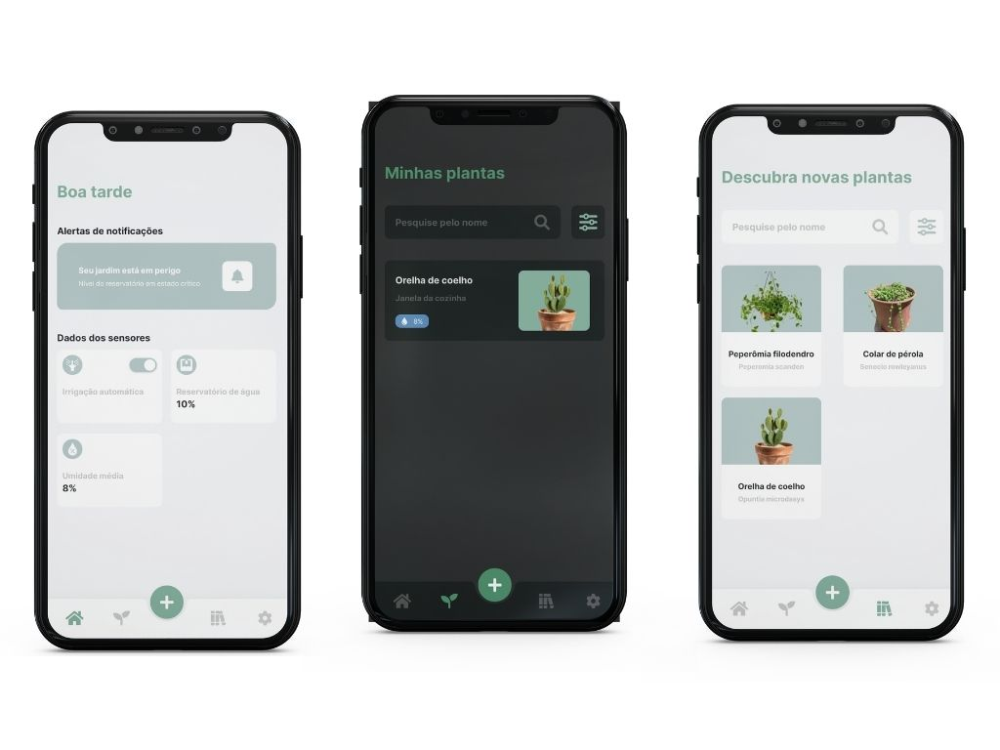

 

  <h3 align="center">Grow House</h3>

  

    App para gerenciar seu jardim
  

  
Índice

    <ol>
    <li>
      <a href="#sobre-o-projeto">Sobre o projeto</a>
      <ul>
        <li><a href="#construido-com">Construido com</a></li>
      </ul>
    </li>
    <li><a href="#contato">Contato</a></li>
  </ol>

## Sobre o projeto

Esse aplicativo foi construído para auxiliar no cultivo em jardins verticais caseiros através de um sistema de monitoramento e irrigação. Com o principal objetivo de ajudar moradores a ter um melhor controle da umidade de suas plantas.

### Construído com

O projeto foi construído utilizando:

- [Expo](https://expo.dev/)
- [Firebase](https://firebase.google.com/)
- [TypeScript](https://www.typescriptlang.org)

## Contato

William James - william.james.pj@gmail.com

Link do projeto: [https://github.com/william-james-pj/GrowHouse](https://github.com/william-james-pj/GrowHouse)
